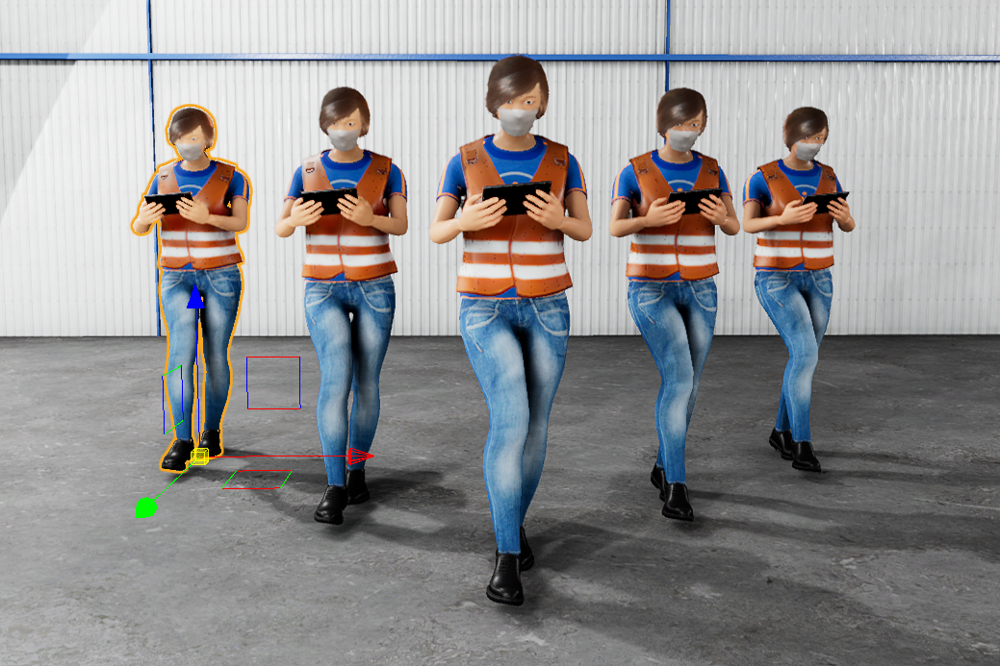
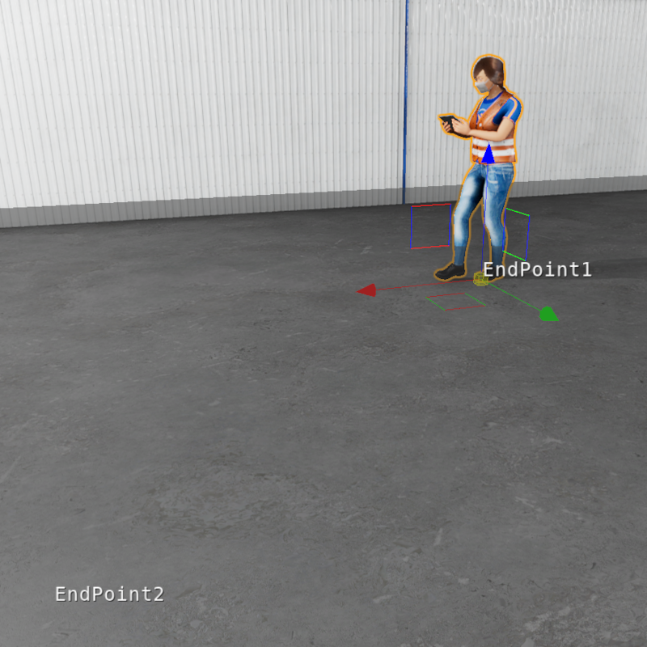
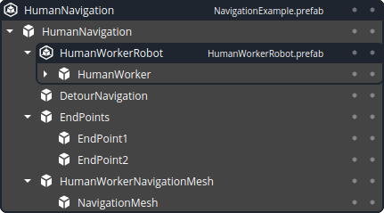

[![Apache License, Version 2.0][apache_shield]][apache]

# HumanWorker Gem for Open 3D Engine (O3DE)

## A bit of context

* [Open 3D Engine](https:://o3de.org) - an open source game & simulation engine. O3DE is extendable through modules
called Gems. This is one of such Gems.
* [Robot Operating System (ROS)](https://docs.ros.org/en/rolling/index.html) - an open source middleware and de facto
standard for robotics.
* [ROS2 Gem](https://github.com/o3de/o3de-extras/tree/development/Gems/ROS2) - an open source module for O3DE which
enables simulation for robotics using modern ROS.

## Requirements
- Any O3DE project with the [O3DE ROS2 Gem](https://github.com/o3de/o3de-extras/tree/development/Gems/ROS2) enabled.

## Description
This gem contains animated human worker assets that can be easily imported into an O3DE project. The human worker can navigate between the waypoints in the scene and is visible to any robots that maneuver in the same area.

In particular, this gem contains the following components:
- Human worker mesh with textures
- Mesh animations of human standing
- Mesh animations of human walking
- O3DE components for basic navigation of the human worker in a scene

## O3DE
Human worker objects are delivered as prefabs, containing models and physics, along with the required O3DE components. Four prefabs are provided within the gem. The simplest one, `HumanWorkerStatic`, is a prefab combining mesh and textures. It can be used as a decoration in the scene. `HumanWorker` is additionally extended by animations. It does not contain any navigation-related components, therefore only _idle_ animation is used in this case. `HumanWorkerRobot` is a prefab that can be used as a base for the fully functional non-player character (NPC) after adding the description of the scene (waypoints, etc.). `HumanWorkerNavigation` is an extension with place holders for such description that should be used in projects. 

### How to use the Gem: NavigationExample

`NavigationExample` prefab contains all the necessities to run the NPC in the scene. In particular, it consists of the animated mesh with textures, and the scene description in the format used by NPC navigation components. The scene description is added to `HumanWorkerNavigation` prefab using O3DE _prefab overrides_.

- `HumanWorkerRobot` is a human worker prefab with some navigational components included. The prefab is modified with the _overrides_ to correctly link with the scene description.
- `Endpoints` is a scene descriptor consisting of the ground truth positions used to build the path for the NPC. Two points are included in this example, but the number of points can be increased. All points need to be added to the `HumanWorkerRobot` prefab `Npc Navigator` component to correctly build the path.
- `HumanWorkerNavigationMesh` is a scene descriptor component allowing to change the parameters of navigation mesh calculation with [Recast framework](https://recastnav.com). Tunable parameters include the bounding box size for mesh calculation and NPC characteristics. Please note, that all `Endpoints` need to be in the bounding box.
- `DetourNavigation` is a scene descriptor component for finding the path.

---

This work is licensed under [Apache License, Version 2.0][apache]. You may elect at your option to use the [MIT License][mit] instead. Contributions must be made under both licenses.

[apache]: https://opensource.org/licenses/Apache-2.0
[mit]: https://opensource.org/licenses/MIT
[apache_shield]: https://img.shields.io/badge/License-Apache_2.0-blue.svg